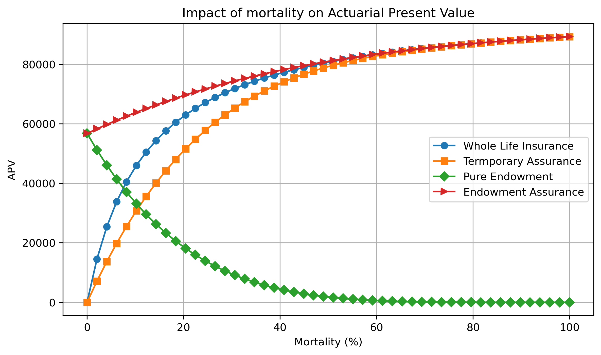

# Actuarial Insurance Pricing Model in Python

## Overview

This project applies actuarial pricing principles to model and evaluate several life insurance products using Python.

The products considered are:

- Whole Life Insurance
- Term Assurance
- Pure Endowment
- Endowment Assurance

The project calculates actuarial present values (APVs), variance, and standard deviation under specified mortality and interest rate assumptions.

---

## Objectives

- Implement actuarial pricing models in Python.
- Calculate APVs for different life insurance products.
- Analyze the effect of mortality assumptions on insurance values.
- Perform sensitivity analysis.
- Visualize actuarial results.

---

## Tools Used

- Python
- NumPy
- Matplotlib

---

## Key Result

The graph below illustrates how different insurance products respond to changes in mortality assumptions.

Products that pay on death generally increase in value as mortality rates rise, while survival-based products such as Pure Endowments decrease in value.

---

## Author

Kell Koomson , 
BSc Actuarial Science And Mathematics
